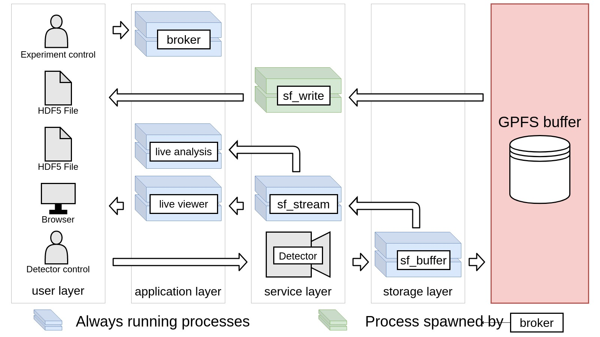

# sf_daq_buffer

The goal of the project is to provide a detector buffering and writing solution 
that meets the needs of SwissFEL data taking. By dividing the problem into 
small components (Microservice architecture) we hope to achieve better 
maintainability and long term stability of the codebase. We try to make the 
code as simple as possible and write unit tests extensively to facilitate 
future changes.

Overview of current architecture and component interaction:



Documentation of individual components:

- [sf-buffer](sf-buffer) (Receive UDP and write buffer files)
- [sf-stream](sf-stream) (Live streaming of detector data)
- [sf-writer](sf-writer) (Read from buffer and write H5)
- [sf-utils](sf-utils) (Small utilities for debugging and testing)
- [jf-live-writer](jf-live-writer) (Live writer to high performance detectors)

## Design goals

- Simplest thing that works.
    - Save time and iterate more quickly.
    - Less moving parts, easier to debug.
    - Avoid external libraries as much as possible.
- Start optimizing only when things break.
    - Many optimization possibilities, but not actually needed.
    - Makes possible to refactor and change code faster.
- Small debuggable and profileable processes.
    - Needs to be able to run on your local machine in a debugger.
    - Asses code performance without guessing.
- As little dependency between processes as possible.
    - Run only the process you want to test.
    - Write unit tests.

## Scope

The scope should be as limited as possible and we should abstain from 
implementing additional features. We isolated the core functionality this buffer 
needs as the following:

- Receiving and assembling detector data.
- Writing detector data to HDF5 files.
- Live streaming detector data to external components.
- Provide logs and analytics for each component.

We focus on the service and storage layer (see overview picture). Everything 
else is not part of this project and should be addresses elsewhere.

## Terminology

In order to unify the way we write code and talk about concepts the following 
terminology definitions should be followed:

- frame (data from a single module)
- image (assembled frames)
- start_pulse_id and stop_pulse_id is used to determine the 
inclusive range (both start and stop pulse_id are included) of pulses.
- pulse_id_step (how many pulses to skip between each image).
- GPFS buffer (detector buffering mechanism based on binary files on GPFS)
- detector_folder (root folder of the buffer for a specific detector on disk)
- module_folder (folder of one module inside the detector_folder)
- data_folder (folder where we group more buffer files based on pulse_id range)
- data_file (the files where the actual data is stored, inside data_folder)

## Build

### In docker
Building and testing with docker does not require you to modify your host 
and its the suggested way to build and test your applications.

Running the **Dockerfile** in the project root copies the current repo folder 
inside the docker container and builds all the targets.

Running the **build\_Dockerfile.sh** builds, tags, and pushes a new 
container version to the registry. You should do this only if you are sure that 
your image is production ready. Please, do not forget 
to push only 100% working images and to increase the VERSION 
(at the beginning of the build_Dockerfile.sh) number of the container.

### On host

To compile this repo you will need to install the following packages on RH7:
- devtoolset-9
- cmake3
- zeromq-devel
- hdf5-devel

```bash
yum install devtoolset-9
yum install cmake3
yum install zeromq-devel
yum install hdf5-devel
```

Step by step procedure to build the repo:

```bash
scl enable devtoolset-9 bash
git clone https://github.com/paulscherrerinstitute/sf_daq_buffer.git
cd sf_daq_buffer
mkdir build
cd build/
cmake3 ..
make
```

It is recommended to create symbolic links to the executables you will be using 
inside your PATH.

Example:
```bash
ln -s "$(pwd)""/""sf_buffer" /usr/bin/sf_buffer
ln -s "$(pwd)""/""sf_stream" /usr/bin/sf_stream
ln -s "$(pwd)""/""sf_writer" /usr/bin/sf_writer
```

## Testing
Each project should have unit tests associated with it written using 
GTest. The tests should always be run before pushing a new container to the 
registry.

Apart from unit-testing an integration pipeline can be started on your local 
machine or dedicated server.

You can first start RabbitMQ and Redis in order to have the basic services 
needed running locally

In the root project folder run:
```bash
docker-compose up -d broker redis 
```

**Note**: you need to have docker-compose installed on your system. You can do this 
by running:
```bash
yum install docker-compose
```

To start and test your new component as part of the integration pipeline run:
```bash
docker-compose up -d 
```

### Warnings

#### UDP recv tests failing

In case unit tests for std-udp-recv are failing the most common cause of 
problems is the rmem limit. Please increase your rmem_max to something large:

```bash 
echo 2147483646 > /proc/sys/net/core/rmem_max
```
You need to do this on your host when running the integration pipeline.

#### Zeromq

Zeromq version 4.1.4 (default on RH7) has a LINGER bug. Sometimes, the last 
message is not sent (the connection gets dropped before the message is in the buffer).
We are currently not using LINGER to extend our processes lifetime, so this is 
not critical. But in the future this might change, so updating to the latest 
version of ZMQ should help us prevent future bug hunting sessions.

Please install a later version:
```bash
cd /etc/yum.repos.d/
wget https://download.opensuse.org/repositories/network:messaging:zeromq:release-stable/RHEL_7/network:messaging:zeromq:release-stable.repo
yum remove zeromq
yum remove openpgm
yum install libsodium-devel
yum install zeromq-devel
```

## Useful links

This is a collections of best links we came across so far during the development of 
this project. They cover various topics somehow related to what we are trying to 
achieve.

### Architecture
- POSIX compliant write order test on GPFS
https://svn.hdfgroup.org/hdf5/branches/hdf5_1_10_0/test/POSIX_Order_Write_Test_Report.pdf
- Best Practice Guide - Parallel I/O
https://prace-ri.eu/wp-content/uploads/Best-Practice-Guide_Parallel-IO.pdf
- MPI-IO/GPFS, an Optimized Implementation of MPI-IO on top of GPFS
https://ieeexplore.ieee.org/stamp/stamp.jsp?tp=&arnumber=1592834
- 10GE network tests with UDP - European XFEL
https://indico.cern.ch/event/212228/contributions/1507212/attachments/333941/466017/10GE_network_tests_with_UDP.pdf
- How to choose between Kafka and RabbitMQ 
https://tarunbatra.com/blog/comparison/How-to-choose-between-Kafka-and-RabbitMQ/


### Software
- Intro to lock free programming
https://preshing.com/20120612/an-introduction-to-lock-free-programming/
- JSON library benchmarks
https://github.com/miloyip/nativejson-benchmark
- Kernel bypass
https://blog.cloudflare.com/kernel-bypass/
- PACKET_MMAP
https://www.kernel.org/doc/Documentation/networking/packet_mmap.txt
- Hyperslab selection 
https://support.hdfgroup.org/HDF5/Tutor/phypecont.html
https://support.hdfgroup.org/HDF5/Tutor/selectsimple.html
- Caching and Buffering in HDF5
https://de.slideshare.net/HDFEOS/caching-and-buffering-in-hdf5
- Chunking in HDF5
https://portal.hdfgroup.org/display/HDF5/Chunking+in+HDF5
- Setting Raw Data Chunk Cache Parameters in HDF5
https://support.hdfgroup.org/pubs/rfcs/RFC_chunk_cache_functions.pdf
- Memory model synchronization modes
https://gcc.gnu.org/wiki/Atomic/GCCMM/AtomicSync
- Is Parallel Programming Hard, And, If So, What Can You Do About It?
https://mirrors.edge.kernel.org/pub/linux/kernel/people/paulmck/perfbook/perfbook.2018.12.08a.pdf
- Linux kernel profiling with perf
https://perf.wiki.kernel.org/index.php/Tutorial
- Introduction to parallel HDF5
https://portal.hdfgroup.org/display/HDF5/Introduction+to+Parallel+HDF5
- Introduction to Scientific I/O
https://www.nersc.gov/users/training/online-tutorials/introduction-to-scientific-i-o/?show_all=1
- Lecture 36: MPI, Hybrid Programming, and Shared Memory
http://wgropp.cs.illinois.edu/courses/cs598-s15/lectures/lecture36.pdf
- Ansi escape codes
https://www.lihaoyi.com/post/BuildyourownCommandLinewithANSIescapecodes.html


### Linux configuration
- CFS: Completely fair process scheduling in Linux
https://opensource.com/article/19/2/fair-scheduling-linux
- perf sched for Linux CPU scheduler analysis
http://www.brendangregg.com/blog/2017-03-16/perf-sched.html
- Tuning CPU scheduler for reducing latency
https://www.scylladb.com/2016/06/10/read-latency-and-scylla-jmx-process/
- RHEL7: How to get started with CGroups.
https://www.certdepot.net/rhel7-get-started-cgroups/
- Cpusets
https://www.kernel.org/doc/Documentation/cgroup-v1/cpusets.txt
- Understanding mlx5 ethtool Counters
https://community.mellanox.com/s/article/understanding-mlx5-ethtool-counters
- Red Hat Enterprise Linux Network Performance Tuning Guide
https://access.redhat.com/sites/default/files/attachments/20150325_network_performance_tuning.pdf
- Low latency 10Gbps Ethernet
https://blog.cloudflare.com/how-to-achieve-low-latency/
- Monitoring and Tuning the Linux Networking Stack: Receiving Data
https://blog.packagecloud.io/eng/2016/06/22/monitoring-tuning-linux-networking-stack-receiving-data/#procnetsoftnet_stat
- Making linux do hard real-time
https://www.slideshare.net/jserv/realtime-linux
- Linux timing and scheduling granularity
https://fritshoogland.wordpress.com/2018/03/13/linux-timing-and-scheduling-granularity/
- Raw Ethernet Programming: Basic Introduction - Code Example
https://community.mellanox.com/s/article/raw-ethernet-programming--basic-introduction---code-example
- Performance Tuning for Mellanox Adapters
https://community.mellanox.com/s/article/performance-tuning-for-mellanox-adapters
- UEFI Workload-based Performance and TuningGuide for HPE ProLiant Gen10 
https://support.hpe.com/hpesc/public/docDisplay?docId=a00016408en_us
- Low Latency Performance Tuning for Red Hat Enterprise Linux 7
https://access.redhat.com/sites/default/files/attachments/201501-perf-brief-low-latency-tuning-rhel7-v2.1.pdf
- Understanding PCIe performance for end hostnetworking
https://www.cl.cam.ac.uk/research/srg/netos/projects/pcie-bench/neugebauer2018understanding.pdf
