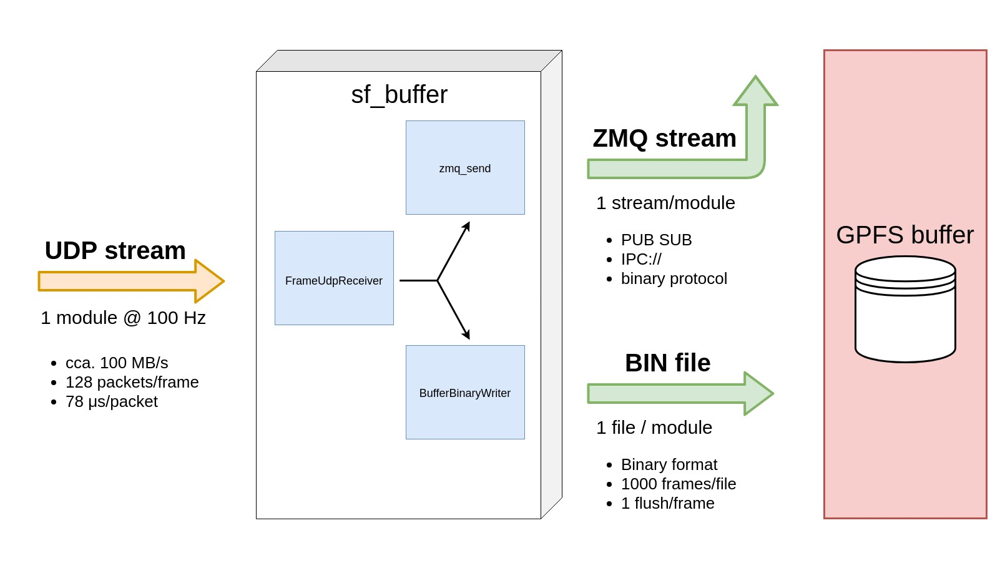
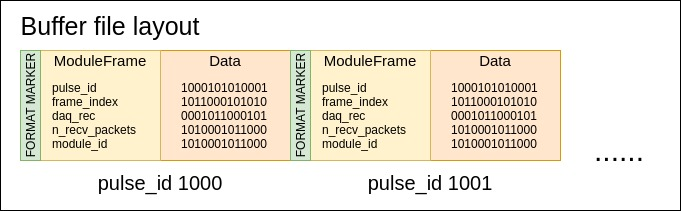
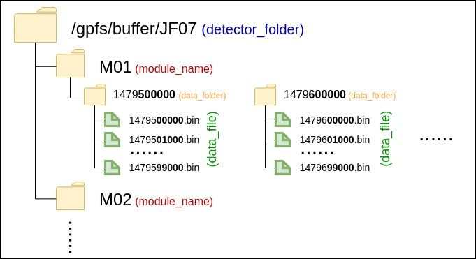

# sf-buffer
sf-buffer is the component that receives the detector data in form of UDP 
packages and writes them down to disk to a binary format. In addition, it 
sends a copy of the module frame to sf-stream via ZMQ.

Each sf-buffer process is taking care of a single detector module. The 
processes are all independent and do not rely on any external data input 
to maximize isolation and possible interactions in our system.

The main design principle is simplicity and decoupling:

- No interprocess dependencies/communication.
- No dependencies on external libraries (as much as possible).
- Using POSIX as much as possible.

We are optimizing for maintainability and long term stability. Performance is 
of concern only if the performance criteria are not met.

## Overview



sf-buffer is a single threaded application (without counting the ZMQ IO threads)
that does both receiving, assembling, writing and sending in the same thread.

### UDP receiving

Each process listens to one udp port. Packets coming to this udp port are 
assembled into frames. Frames (either complete or with missing packets) are 
passed forward. The number of received packets is saved so we can later 
(at image assembly time) determine if the frame is valid or not. At this point 
we do no validation.

We are currently using **recvmmsg** to minimize the number of switches to 
kernel mode.

We expect all packets to come in order or not come at all. Once we see the 
package for the next pulse_id we can assume no more packages are coming for 
the previous one, and send the assembled frame down the program.

### File writing

Files are written to disk in frames - one write to disk per frame. This gives 
us a relaxed 10ms interval of 1 MB writes.

#### File format

The binary file on disk is just a serialization of multiple 
**BufferBinaryFormat** structs:
```c++
#pragma pack(push)
#pragma pack(1)
struct ModuleFrame {
    uint64_t pulse_id;
    uint64_t frame_index;
    uint64_t daq_rec;
    uint64_t n_recv_packets;
    uint64_t module_id;
};
#pragma pack(pop)

#pragma pack(push)
#pragma pack(1)
struct BufferBinaryFormat {
    const char FORMAT_MARKER = 0xBE;
    ModuleFrame meta;
    char data[buffer_config::MODULE_N_BYTES];
};
#pragma pack(pop)
```



Each frame is composed by:

- **FORMAT\_MARKER** (0xBE) - a control byte to determine the validity of the frame.
- **ModuleFrame** - frame meta used in image assembly phase.
- **Data** - assembled frame from a single module.

Frames are written one after another to a specific offset in the file. The 
offset is calculated based on the pulse_id, so each frame has a specific place 
in the file and there is no need to have an index for frame retrieval.

The offset where a specific pulse_id is written in a file is calculated:

```c++
// We save 1000 pulses in each file.
const uint64_t FILE_MOD = 1000

// Relative index of pulse_id inside file.
size_t file_base = pulse_id % FILE_MOD;
// Offset in bytes of relative index in file.
size_t file_offset = file_base * sizeof(BufferBinaryFormat);
```

We now know where to look for data inside the file, but we still don't know 
inside which file to look. For this we need to discuss the folder structure.

#### Folder structure

The folder (as well as file) structure is deterministic in the sense that given 
a specific pulse_id, we can directly calculate the folder, file, and file 
offset where the data is stored. This allows us to have independent writing 
and reading from the buffer without building any indexes.

The binary files written by sf_buffer are saved to:

[detector_folder]/[module_folder]/[data_folder]/[data_file].bin

- **detector\_folder** should always be passed as an absolute path. This is the 
container that holds all data related to a specific detector.
- **module\_folder** is usually composed like "M00", "M01". It separates data 
from different modules of one detector.
- **data\_folder** and **data\_file** are automatically calculated based on the 
current pulse_id, FOLDER_MOD and FILE_MOD attributes. This folders act as our 
index for accessing data.



```c++
// FOLDER_MOD = 100000
int data_folder = (pulse_id % FOLDER_MOD) * FOLDER_MOD; 
// FILE_MOD = 1000
int data_file = (pulse_id % FILE_MOD) * FILE_MOD; 
```

The data_folder and data_file folders are named as the first pulse_id that 
should be stored inside them.

FOLDER_MOD == 100000 means that each data_folder will contain data for 100000
pulses, while FILE_MOD == 1000 means that each file inside the data_folder 
will contain 1000 pulses. The total number of data_files in each data_folder 
will therefore be **FILE\_MOD / FOLDER\_MOD = 100**.

#### Analyzing the buffer on disk
In **sf-utils** there is a Python module that allows you to read directly the 
buffer in order to debug it or to verify the consistency between the HDF5 file 
and the received data.

- VerifyH5DataConsistency.py checks the consistency between the H5 file and 
buffer.
- BinaryBufferReader.py reads the buffer and prints meta. The class inside 
can also be used in external scripts.

### ZMQ sending

A copy of the data written to disk is also send via ZMQ to the sf-stream. This 
is used to provide live viewing / processing capabilities. Each module data is 
sent separately, and this is later assembled in the sf-stream.

We use the PUB/SUB mechanism for distributing this data - we cannot control the 
rate of the producer, and we would like to avoid distributed image assembly 
if possible, so PUSH/PULL does not make sense in this case.

We provide no guarantees on live data delivery, but in practice the number of 
dropped or incomplete frames in currently negligible.

The protocol is a serialization of the same data structures we use to 
write on disk (no need for additional memory operations before sending out 
data). It uses a 2 part multipart ZMQ message:

- The first part is a serialization of the ModuleFrame struct (see above).
- The second part is the data field in the BufferBinaryFormat struct (the frame
data).
