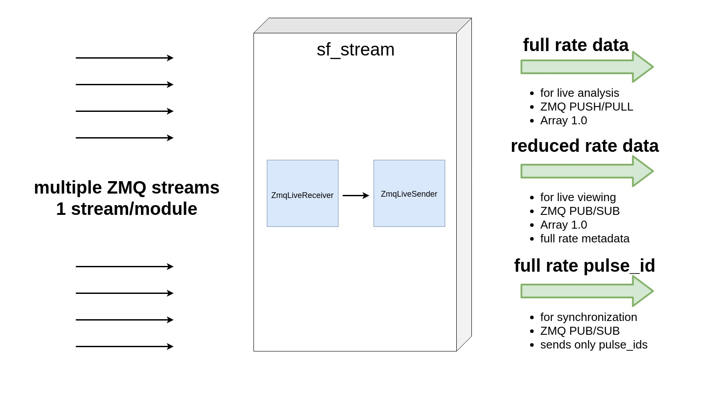
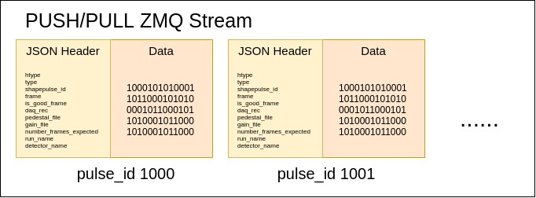
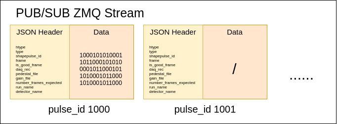
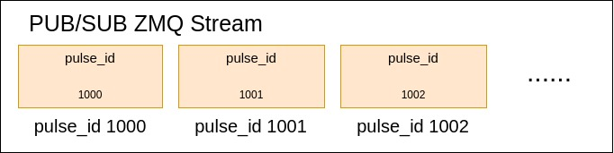

# sf-stream
sf-stream is the component that receives a live stream of frame data from 
sf-buffers over ZMQ and assembles them into images. This images are then 
sent again over ZMQ to external components. There is always only 1 sf-stream 
per detector.

It currently has 3 output streams:

- **Full data full meta** rate stream (send all images and meta)
- **Reduced data full meta** rate stream (send less images, but 
all meta)
- **Pulse_id** stream (send only the current pulse_id)

In addition to receiving and assembling images, sf-stream also calculates 
additional meta and constructs the structures needed to send data in 
Array 1.0 protocol.

This component does not guarantee that the streams will always contain all 
the data - it can happen that frame resynchronization is needed, and in this 
case 1 or more frames could potentially be lost. This happens so rarely that in 
practice is not a problem. 

## Overview



sf-stream is a single threaded application (without counting the ZMQ IO threads)
that is used for providing live assembled images to anyone willing to listen. 

In addition, it also provides a pulse_id stream, which is the most immediate 
pulse_id feedback we currently have in case we need to synchronize external 
components to the current machine pulse_id.

## ZMQ receiving
Each ZMQ stream is coming from a separate sf-buffer. This means that we have as 
many connections as we have modules in a detector.

Messages are multipart (2 parts) and are received in PUB/SUB mode.

There is no need for special synchronization between modules as we expect that 
frames will always be in the correct order and all modules will provide the 
same frame more or less at the same time. If any of this 2 conditions is not 
met, the detector is not working properly and we cannot guaranty that sf-stream 
will work correctly.

Nonetheless we provide the capability to synchronize the streams in image 
assembly phase - this is needed rarely, but occasionally happens. In this sort 
of hiccups we usually loose only a couple of consecutive images.

### Messages format
Each message is composed by 2 parts:

- Serialization of ModuleFrame in the first part.
- Frame data in the second part.

Module frame is defined as:
```c++
#pragma pack(push)
#pragma pack(1)
struct ModuleFrame {
    uint64_t pulse_id;
    uint64_t frame_index;
    uint64_t daq_rec;
    uint64_t n_recv_packets;
    uint64_t module_id;
};
#pragma pack(pop)
```

The frame data is a 1MB (1024*512 pixels * 2 bytes/pixel) blob of data in 
**uint16** representing the detector image.

## Image assembly
We first synchronize the modules. We do this by reading all sockets and 
deciding the largest frame pulse_id among them (max_pulse_id). We then calculate 
the diff between a specific socket pulse_id and the max_pulse_id. 
This difference tells us how many messages we need to discard from a specific socket.

This discarding is the source of possible missing images in the output stream.
It can happen in 3 cases:

- At least one of the detector modules did not sent any packets for the specific 
pulse_id.
- All the packets from a specific module for a pulse_id were lost before UDP 
receiving them.
- ZMQ HWM was reached (either on the sf-buffer or sf-stream) and the message was 
dropped.

All this 3 cases are highly unlikely, so synchronization is mostly needed when 
first starting sf-stream. Different sockets connect to sf-buffers at different 
times. Apart from the initial synchronization there should be no need to 
re-synchronize modules in a healthy running environment.

If an image is missing any ZMQ messages from sf-buffers (not all modules data 
arrived), the image will be dropped. We do not do partial reconstruction in 
sf-stream. However, it is important to note, that this does not cover the case 
where frames are incomplete (missing UDP packets on sf-buffer) - we still 
assemble this images as long as at least 1 packet/frame for a specific pulse_id 
arrived.

## ZMQ sending

We devide the ZMQ sending to 3 types of stream:

- Data processing stream. This is basically the complete stream from 
the detector with all meta and data. It can be described as full data full
meta stream. Only 1 client at the time can be connected to this stream 
(PUSH/PULL for load balancing).

- Live viewing stream. This is a reduced data full meta stream. We send 
meta for all frames, but data only for subset of them (10Hz, for example). 
Any number of clients can connect to the 10Hz stream, because we use PUB/SUB 
for this socket.

- Pulse_id stream. This is a stream that sends out only the current pulse_id.
It can be used to synchronize any external system with the current pulse_id 
being recorded. Multiple clients can connect to this stream.

In the data processing and live viewing stream we use 
[Array 1.0](https://github.com/paulscherrerinstitute/htypes/blob/master/array-1.0.md)
as our protocol to be compatible with currently available external components.

We use following fields in the JSON header:

| Name | Type | Comment |
| --- | --- | --- |
| pulse_id | uint64 |bunchid from detector header|
|frame|uint64|frame_index from detector header|
|is_good_frame|bool|true if all packets for this frame are present|
|daq_rec|uint32|daqrec from detector header|
|pedestal_file|string|Path to pedestal file|
|gain_file|string|Path to gain file|
|number_frames_expected|int|Number of expected frames|
|run_name|string|Name of the run|
|detector_name|string|Name of the detector|
|htype|string|Value: "array-1.0"|
|type|string|Value: "uint16"|
|shape|Array[uint64]|Shape of the image in stream|

### Full data full meta stream

This stream runs at detector frequency and uses PUSH/PULL to distribute data 
to max 1 client (this client can have many processes, but it needs to be a 
single logical entity, since the images are evenly distributed to all 
connected sockets).



The goal here is to provide a complete copy of the detector image stream 
for purposes of online analysis. Given the large amount of data on this 
stream only "pre-approved" applications that can handle the load should be 
attached here.

### Reduced data full meta stream

This streams also runs at detector frequency for JSON headers (meta), but 
it sends only part of the images in the stream. The rest of the images are 
sent as empty buffers (the receiver needs to be aware of this behaviour, as 
Array 1.0 alone does not define it).



This is the lightweight version of the image stream. Any number of clients 
can connect to this stream (PUB/SUB) but no client can do load 
balancing automatically (it would require PUSH/PULL).

This is a "public interface" for anyone who wants to get detector data live, 
and can do with only a subset of images.

### Pulse_id stream

This stream runs ar detector frequency in PUB/SUB mode. The only thing it 
does is sends out the pulse_id (of the just received image) in uint64_t 
format.



This is also a "public interface" for anyone who wants to get the current 
system pulse_id.