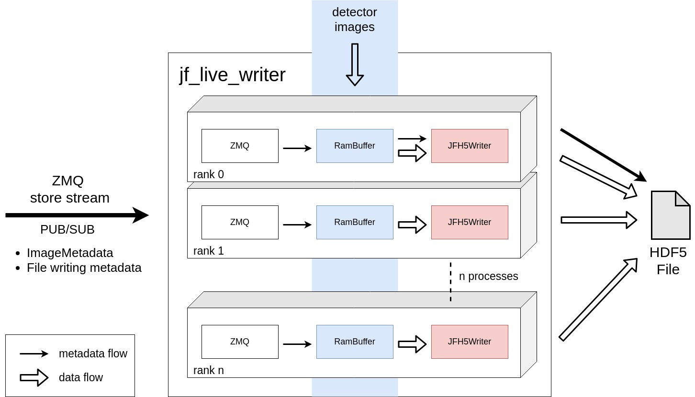
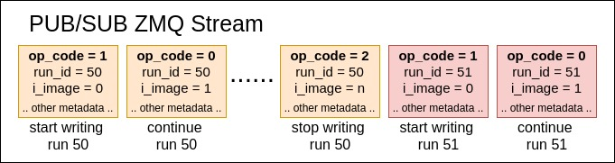

# std-det-writer

This component is a PHDF5 based MPI writer for high performance detectors 
that need more than 2GB/s of write speed. It parallelizes the HDF5 writing to 
multiple processes in order to overcome the cca. 3GB/s single stream 
write limit on GPFS.

It expects an input ZMQ stream that contains metadata about what and where to 
write and access to the RamBuffer of the images one wants to write.

This writer is stateless but tied to a specific detector. There are no 
configuration states, all the information for writing files is expected to 
come from the input metadata stream. The images data is directly taken from the
existing buffer without additional memory copies.

## Overview


The ZMQ store stream is a PUB/SUB stream that gets distributed to all 
ranks. This stream caries both ImageMetadata information and file writing 
metadata and is generated and sent by the writer agent.

For writing image data, each process decides based on its rank if the 
particular store stream message is for him and writes the requested image.
For writing image metadata, the rank 0 is always responsible. The metadata is 
always written only by the process with **RANK = 0**.

When to start writing a new file or when to close an existing one is also 
decided based on the metadata in the store stream. There is no state machine 
in the writer, but which action to take is based solely on the received 
metadata. This saves us the need to have inter-rank communication and makes 
for a more simple writer.

### ZMQ Store Stream format
This stream is composed by 2 parts. The first part is the already known 
**ImageMetadata** the **jf-assembler** provides, and the second part is 
provided by the **writer-agent**.

Each message in the stream has this format:

```c++
#pragma pack(push)
#pragma pack(1)
struct StoreStream {
    ImageMetadata image_metadata;

    int64_t run_id;
    uint32_t i_image;
    uint32_t n_images;
    uint32_t image_y_size;
    uint32_t image_x_size;
    uint32_t op_code;
    uint32_t bits_per_pixel;
};
#pragma pack(pop)

#pragma pack(push)
#pragma pack(1)
struct ImageMetadata {
    uint64_t pulse_id;
    uint64_t frame_index;
    uint32_t daq_rec;
    uint32_t is_good_image;
};
#pragma pack(pop)
```

#### StoreStream

| Name | Type | Comment |
| --- | --- | --- |
| run_id | int64 | Run id used to construct the output file name. |
| i_image | uint32_t | Current image index inside this run. |
| n_images | uint32_t | Total number of images in this run. |
| image_y_size | uint32_t | Y image size in pixels. |
| image_x_size | uint32_t | X image size in pixels. |
| op_code | uint32_t | State transition information for the writer. |
| bits_per_pixel | uint32_t | How many bits does 1 pixel have. 8, 16 or 32. |

Some details regarding how this fields are used:

- **run\_id**: Currently the output file name is simply **[run\_id].h5**.
- **i\_images**: Based on this each rank decides if the received message is for
itself and needs to write the corresponding image data to file.
- **op_code**: This is used to steer the file writing and to avoid the need 
for a state machine:
    - op_code = 0 (Continue - just write to the same file as you already are)
    - op_code = 1 (Start - create a new file for this run_id)
    - op_code = 2 (Stop - close the current file)
    
Since the writer is relying on the correct sequence of messages in the input 
stream instead of having an internal state machine, 
the input stream must always follow a valid pattern of messages:



The sequence must always follow:

- op_code = 1 (also a new run_id if you do not want to overwrite the previous file)
- op_code = 0 (same run_id as the last message)
- op_code = 2 (same run_id as the last message)
- etc.

In case the sequence is broken (wrong send order from the writer agent or lost 
messages, etc.) the writer will ignore the received message. An operational 
state can be restored by sending a **op\_code = 2** message.

Images are written only when op_code = 0, meaning that the start and stop 
message are not used for writing data. This allows to send the stop message 
in case we need to reset the writer status at any point.

#### ImageMetadata
This comes from jf_assembler without modifications for a particular 
image. 

## Build

### Build inside docker
The easiest way to build and test the jf-live-writer is to use the 
provided docker container. You need to start building it 
from the project **root**:

```bash
docker build -f std-det-writer/debug.Dockerfile -t std-det-writer .
```
(Running this command from the project root is mandatory as the entire project 
folder needs to be part of the build context.)

This will copy your current working directory to the image and build the 
jf-live-writer. Once you've dont this, you can start 

### Build on your machine

In addition to the libraries needed for sf_daq, you need **mpich** installed:

```bash
yum install mpich-devel
ln -v -s /usr/include/mpich-x86_64/* /usr/include/
```

Making the soft links for mpich headers to your /usr/include is 
necessary due to HDF5.

#### Building with cmake
In order to build this executable you need to specify the cmake variable
```
cmake3 -DBUILD_JF_LIVE_WRITER=ON 
```
The project will not build if you do not have installed the PHDF5 library.
Please follow instructions below on how to do that manually.

#### Install PHDF5
```
wget https://support.hdfgroup.org/ftp/HDF5/releases/hdf5-1.12/hdf5-1.12.0/src/hdf5-1.12.0.tar.gz
tar -xzf hdf5-1.12.0.tar.gz
cd hdf5-1.12.0
./configure --enable-parallel 
make install
sudo ln -v -s `pwd`/hdf5/lib/* /usr/lib64/
sudo ln -v -s `pwd`/hdf5/include/* /usr/include/
```

